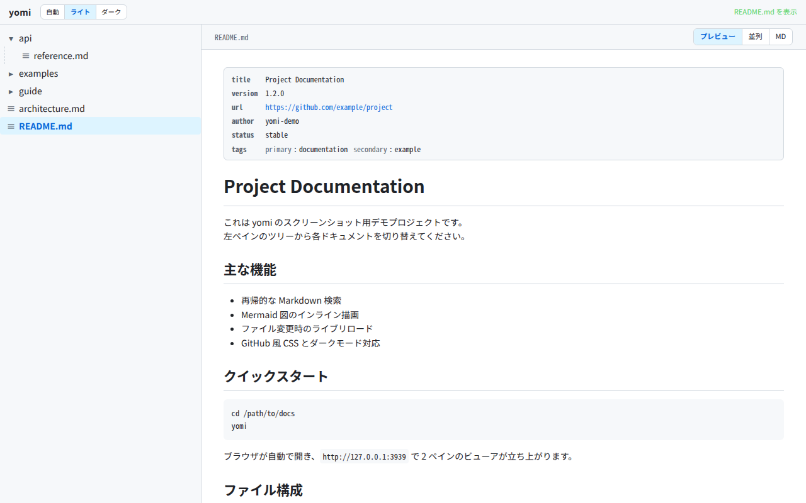
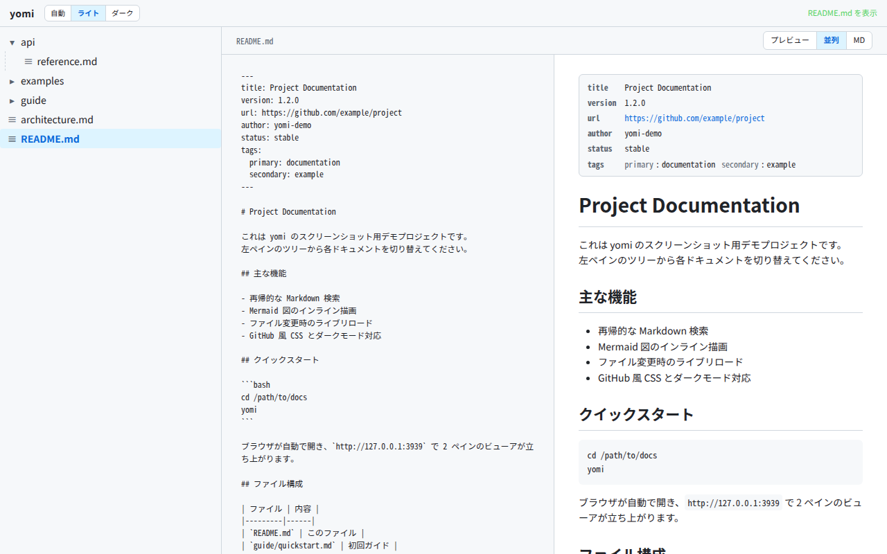
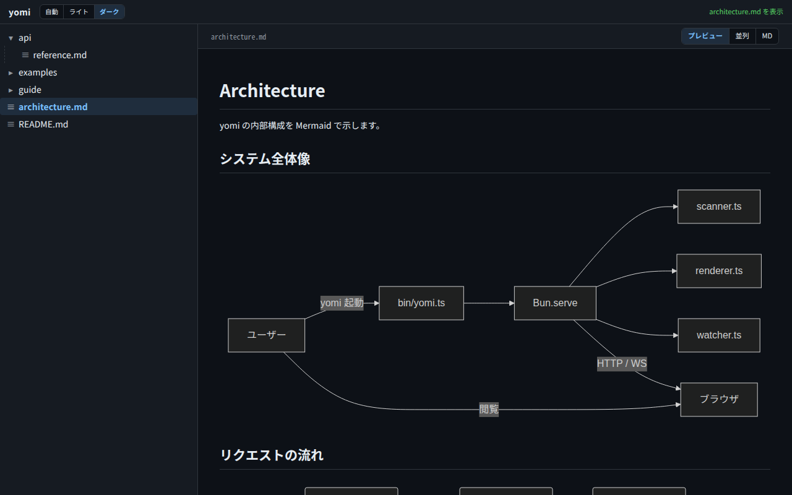

# yomi (読み)

[日本語](README.md) | **English**

[](https://github.com/ef-tech/yomi/actions/workflows/ci.yml)
[](LICENSE)

A local Markdown viewer. A command-line tool that recursively collects the `.md` files under the current directory and lets you read them in a two-pane browser UI (left: tree, right: preview).

<picture>
  <source media="(prefers-color-scheme: dark)" srcset="docs/screenshots/dark-preview.png">
  
</picture>

## Features

- Launches with `cd <your docs> && yomi`
- Inline rendering of Mermaid diagrams
- Auto-reload on file save (live preview)
- GitHub-style CSS, follows the system dark/light setting
- Local-only by default (`127.0.0.1`); use `--share` to view from other devices on the same LAN
- In-browser Markdown editing (save with Ctrl/Cmd+S)
- Table of contents (TOC) panel generated from headings (with scroll-following highlight)
- Link navigation inside the preview: relative md jumps within yomi, external URLs get a warning
- Browser back/forward support; reload restore and URL sharing via `?path=foo.md`
- Click GFM task lists `- [ ] xxx` in the preview to toggle ON/OFF; changes are written back to the md file
- Images in Markdown `` are resolved by relative path and displayed (same dir, `../`, and subdirectories)
- UI language switch (Japanese / English, auto-follows the browser language, saved to `localStorage`)

## Screenshots

| Split view (Markdown + preview) | Inline Mermaid rendering (dark) |
|---|---|
|  |  |

## Requirements

- [Bun](https://bun.sh) v1.0+

## Installation

```bash
bun install -g github:ef-tech/yomi
```

## Updating

To pull the latest `main`, run the same command again.
Reinstalling under the same package name makes Bun fetch and overwrite with the latest remote source.

```bash
bun install -g github:ef-tech/yomi
```

To use a specific tag, branch, or commit:

```bash
bun install -g github:ef-tech/yomi#v0.2.0    # tag
bun install -g github:ef-tech/yomi#main      # branch
bun install -g github:ef-tech/yomi#abc1234   # commit SHA
```

## Uninstall

```bash
bun remove -g yomi
```

To check the installed version:

```bash
bun pm ls -g | grep yomi
```

## Usage

```bash
cd /path/to/docs
yomi
```

The browser opens automatically.

### Subcommands

```
yomi [options]        Open the current directory (same as yomi up)
yomi up [options]     Start (use -d to run in the background)
yomi down [options]   Stop a yomi started in the background
yomi list             List the yomi instances running in the background
```

`yomi` without arguments still starts in the foreground as before (an alias for `yomi up`).

### Options

```
yomi up [options]
  -d, --detach    Run in the background and release the terminal
                  Stop it with yomi down; logs go to the state directory
  --port <n>      Specify the port (default: auto-discovery from 3939)
  --no-open       Do not open the browser automatically
  --open          Open the browser (-d does not open it by default)
  --host <addr>   Bind address (default: 127.0.0.1, local only)
  --share         Bind to 0.0.0.0 so other devices on the same LAN can view
                  (exposed without authentication; trusted networks only)
                  Cannot be combined with --host
  --depth <n>, -L <n>
                  Limit the scan/watch depth (equivalent to tree -L; default: unlimited)
                  1 = root level only. Deeper md files are neither listed nor watched,
                  but can still be opened by following a link (use .yomiignore to hide)
  --help, -h      Help

yomi down [options]
  (no argument)   Stop the yomi started in the current directory
  --all           Stop every running yomi
  --port <n>      Stop the yomi on the given port
```

For large directory trees, `--depth` (short form `-L`) narrows the levels scanned/watched at startup. Just like `tree -L <level>`, the root level counts as depth 1. Markdown beyond the depth is left out of the startup scan (its contents do not appear in the tree) and is also excluded from file watching (live reload), so startup is faster and the number of inotify watches is lower. To browse deeper levels from the tree, restart with a higher depth.

**`--depth` is not a way to hide things.** Directories beyond the depth still appear in the tree (they are simply not opened), and the Markdown inside them can still be opened by following a link. To hide something, use [`.yomiignore`](#customizing-exclude-patterns-yomiignore).

### Running in the background (Issue #68, #69)

Keep yomi resident the same way you would with `docker compose up -d` / `down`. It does not occupy a terminal, so you can keep several projects open at once.

```bash
cd /path/to/docs
yomi up -d          # Start in the background (prints pid, URL and log path)

yomi list           # List the running instances
# PID      PORT   PUBLIC  DIR
# 1053537  39601  local   /path/to/docs
# 1053577  39602  share   /path/to/other

yomi down           # Stop the instance started in this directory
yomi down --all     # Stop every running instance
yomi down --port 3939
```

- **`yomi down` defaults to the current directory only.** Pass `--all` explicitly to stop everything, so a yomi opened for another project is never taken down by accident
- The `PUBLIC` column shows `local` (this machine only) or `share` (exposed to the LAN)
- State and logs live under `${XDG_STATE_HOME:-~/.local/state}/yomi/` (`instances/<port>.json` and `logs/<port>.log`)
- Records left behind by an abnormal exit are pruned automatically when you run `yomi list` or `yomi down`
- `-d` does not open the browser. Use `yomi up -d --open` if you want it opened

### Quick open (Ctrl/Cmd+P) — Issue #54

`Ctrl/Cmd+P` opens a file search panel so you can **switch files without touching the mouse** (on mobile, use "🔍 Search files" in the ⋮ menu).

| Key | Action |
|---|---|
| `Ctrl/Cmd+P` | Open / close |
| Typing | Filter by file name and relative path |
| `↑` / `↓` | Move through the candidates (wraps at the ends) |
| `Enter` | Open the selected file |
| `Esc` | Close (focus returns to where it was) |

- Matching is **subsequence-based**, so you can skip characters (`dsgn` → `design/design-notes.md`). Case is ignored
- **Files with the same name are distinguished by their path** (`guide.md docs` vs `guide.md docs/api`, with the file name as the primary label and the directory as secondary)
- Matched characters are shown in bold with an underline (not signalled by colour alone)
- **The candidates are exactly what the left tree shows.** Files excluded by `.yomiignore` or beyond `--depth` never appear
- Navigation goes through the same path as a normal file selection, so the **unsaved-changes prompt, browser history, and tree highlighting all behave as before**
- **It opens while editing too.** Choosing a candidate with unsaved changes shows the same discard prompt as a normal file selection
- **Japanese file names are searchable too.** Keys are left alone while an IME is composing, so confirming a conversion with `Enter` never opens a file by accident

Full-text search of file contents is out of scope.

### File tree

The toolbar at the top of the left tree lets you expand/collapse the whole tree at once.

- **⊞ Expand all**: expand every directory
- **⊟ Collapse all**: return to the initial state (root level only)

Directory open/closed state is saved to `localStorage` and preserved across reloads.

### UI language switch (Japanese / English)

The language toggle in the top bar (**Auto / EN / 日本語**, inside the ⋮ menu on mobile) switches the UI language.

- **Auto**: English if the browser language (`navigator.language`) is `en*`, otherwise Japanese
- **EN / 日本語**: pin explicitly
- The choice is saved to `localStorage` (`yomi:lang:v1`) and preserved across reloads
- `<html lang>` follows the selected language
- Markdown content, file names, and paths are not translated (only UI labels, status messages, and API error messages)

### Table of contents (TOC)

The "📖 TOC" button at the top-right (or `Ctrl/Cmd+Shift+O`) opens/closes a table-of-contents panel on the right, generated from the Markdown headings.

- **Scroll-following highlight**: the current section is highlighted automatically as you scroll
- **Click to jump**: clicking an entry smooth-scrolls to that heading
- **Level switch**: "▾ Show H4-" at the bottom of the panel toggles `H1-H3` only ↔ all of `H1-H6`
- **Mode coordination**:
  - Pressing the button in `MD` mode temporarily switches to `Preview` (reverts when the TOC is closed; `localStorage` is not changed)
  - During edit mode the TOC is temporarily hidden and restored when editing ends
- Persistence: open/closed state and level are saved to `localStorage`

For documents with 0 headings it shows "No headings".

### Link navigation

Behavior when clicking `<a href>` links inside the preview:

| Type | Example | Behavior |
|---|---|---|
| Relative md path | `[X](other.md)` `[Y](../bar.md)` | Navigate to that file within yomi (same as selecting it in the left tree) |
| Extensionless relative | `[X](foo)` | Search in the order `foo.md` → `.markdown` → `.mdx` and navigate |
| Relative PDF path | `[X](return_voucher.pdf)` | Open `/api/asset?path=...` in a new tab and show it in the browser's built-in PDF viewer (Issue #37) |
| Relative csv / data file | `[X](sales.csv)` `[Y](../data/report.xlsx)` | Download it from `/api/asset?path=...` (Issue #64) |
| Anchor | `[B](#usage)` | Keep the existing heading-jump behavior |
| External URL | `[G](https://...)` `[M](mailto:...)` | Warning banner → "Open" opens a new tab, "Close" cancels |
| `javascript:` scheme | `[X](javascript:...)` | **Blocked unconditionally** |
| Non-existent relative path | `[X](missing.md)` | Shows "File not found", no navigation |

The external-URL warning banner can be dismissed with the Esc key, and new tabs open with `noopener,noreferrer` (tabnabbing prevention). Clicking an internal link during edit mode prompts a confirmation dialog if there are unsaved changes.

### Image preview

Relative paths in Markdown `` are served by yomi via `GET /api/asset?path=...` and shown in the preview. References like a `screenshot.png` next to the md or `../images/logo.svg` display as-is.

| Type | Example | Behavior |
|---|---|---|
| Relative-path image | `` `` | Resolved from the current md's directory and displayed |
| External URL | `` `` | Passed straight to `` |
| `javascript:` scheme | `` | **Blocked unconditionally** (rewritten to empty src) |
| Extension not in the allowlist | `` `` | 400 on the `/api/asset` side (read rejected) |
| `..` outside root / absolute path | `` `` | 400 via `resolveSafe` |
| Over size (>50 MB) | Large image | 413 |

Supported extensions: `.png` / `.jpg` / `.jpeg` / `.gif` / `.webp` / `.svg` / `.avif` / `.bmp` / `.ico`. SVG is served with `X-Content-Type-Options: nosniff` + `Content-Disposition: inline` to suppress XSS via MIME sniffing. A strong ETag (`"<sha256-prefix>"`) + `Cache-Control: no-cache` is returned, so the browser uses `If-None-Match` 304 caching while re-fetching on the next request whenever the image is edited (Issue #22 switched to content-based ETag, so even rewrites that preserve mtime + size via `cp -a` are reliably detected). The file is read via an fd obtained with `fs.open`, doing stat + read through that same fd, so even a symlink swap after resolveSafe (TOCTOU) cannot cause an unintended file to be served.

Clicking an image in the preview opens that image URL in a new tab (the `` is wrapped in `<a target="_blank" rel="noopener noreferrer">`). The browser's native image view provides full-size / zoom / save. A `cursor: zoom-in` shows on hover. An image wrapped in a link in markdown like `[](url)` prioritizes the link target and does not trigger the image jump.

### Attachment downloads (Issue #64)

Data files linked from Markdown (e.g. `[Sales](data/sales.csv)`) are served from `/api/asset?path=...` with `Content-Disposition: attachment`, so a click saves them directly.

| Kind | Extensions | Disposition |
|---|---|---|
| Image | `.png` / `.jpg` / `.jpeg` / `.gif` / `.webp` / `.svg` / `.avif` / `.bmp` / `.ico` | `inline` (shown in the preview / full size in a new tab) |
| PDF | `.pdf` | `inline` (browser's built-in PDF viewer) |
| Data / document / archive | `.csv` / `.tsv` / `.txt` / `.json` / `.yaml` / `.yml` / `.zip` / `.xlsx` / `.docx` / `.pptx` | `attachment` (download) |

- The filename is sent in `filename*=UTF-8''` form, so non-ASCII filenames are preserved.
- **Extensions outside the allowlist are not served** (400). `.html` / `.htm` / `.xhtml` / `.js` / `.mjs` are deliberately excluded because serving them would open a script-execution / HTML-rendering path (the Issue #21 / #22 XSS hardening).
- Root-escape rejection via `resolveSafe`, the 50 MB size cap, `X-Content-Type-Options: nosniff`, and the strong ETag are shared with images and PDFs.

### Scroll sync in split mode (Issue #9)

In **Split** mode (two panes: md source + preview), the scroll positions sync left/right based on headings. Absolute source line numbers are embedded on `<h1>`–`<h6>` via a `data-line` attribute, and a pure function linearly interpolates between the line-based Y coordinate on the source side and `offsetTop` on the preview side.

| Mode | Sync |
|---|---|
| `preview` (single) | N/A |
| `Split` | Enabled (default ON) |
| `MD` (single) | N/A |
| Edit mode (textarea + preview) | Disabled (to avoid disturbing the textarea caret) |

For md with 0 headings, no pairs can be built, so the two panes scroll independently. Pairs are rebuilt after Mermaid diagrams finish async rendering, so sync stays correct even for md with diagrams. The setting is saved to `localStorage` (`yomi:scrollSync:v1`, default ON).

### Navigation / history

- The "currently open file" is reflected in the URL query `?path=foo.md`
- Opening a URL that includes a heading `?path=foo.md#heading` scrolls to that heading (deep link)
- Browser **back / forward** works naturally per file switch (both preview-link clicks and left-tree selections are pushed to history)
- Reloading restores the current file + heading position from the URL
- Copy-pasting the URL reproduces the same screen (openable on another machine / tab started in the same directory)
- Live reload (re-render on file-save detection) and anchor jumps (`#heading`) do not push history
- Pressing "Back" during edit mode prompts a confirmation dialog if there are unsaved changes; canceling jumps back to the file being edited

### Interactive task lists

GFM task lists `- [ ] xxx` / `- [x] xxx` can be clicked directly in the preview to toggle ON/OFF. The checked state is written back to the md file, so you can "track progress while reading" TODO lists or procedures.

- Click a checkbox in the preview → that line flips between `- [ ]` ⇄ `- [x]` and is saved via `POST /api/file`
- Reuses the existing optimistic lock (`baseSha`); a conflict banner appears if it was updated elsewhere
- Not clickable during edit mode (edit mode takes priority, avoiding dual state management)
- Indented (nested) `  - [ ] subtask` and `*` / `+` bullets are supported
- Task-like strings inside code fences (```...``` / `~~~...~~~`) are ignored

### Customizing exclude patterns (`.yomiignore`)

Placing a `.yomiignore` directly under the current directory lets you add to the default exclude patterns (`node_modules`, `.git`, `dist`, etc.). One directory/file name per line; lines starting with `#` are comments.

```
# .yomiignore
# Exclude personal notes
private
backup
.archive
```

#### Undoing a default exclude (`!name`)

**A line starting with `!` is a negation** and removes that name from the exclude set. This works on the default patterns too (`node_modules`, `dist`, `build`, `vendor`, …).

```
# .yomiignore
# I want to read the md generated into build/ as well
!build
```

- **Negations apply both to the defaults and to lines you added yourself in `.yomiignore`.** The order is fixed as two steps: union of defaults + additions, then subtract the negations
- Because of that, writing both `foo` and `!foo` means **the negation wins regardless of the order you wrote them in**
- To exclude a name that literally starts with `!`, write `\!name` (to negate that entry, write `!!name`)
- ⚠️ **Undoing a large default such as `node_modules` or `.git` sharply increases what gets scanned at startup and watched afterwards**, which can hit the inotify limit (see [Live reload and the watch limit (Linux)](#live-reload-and-the-watch-limit-linux)). Only undo the directories you actually want to read
- ⚠️ **Before v0.21.0 a line starting with `!` meant "exclude the name `!…`".** It is a negation now, so rewrite any such line as `\!name` — otherwise **the exclusion silently stops applying**

#### Syntax limitations

Only exact directory/file name matches are supported; globs (`*`, `**`) are not.

- **Patterns containing `/` have no effect.** Writing `private/creds.csv` matches nothing, because patterns are compared against each path segment individually. Write a single segment instead, such as `private` (directory name) or `creds.csv` (file name).
- **Matching happens against the resolved real path.** If the thing you want to exclude is a symlink, also list the **target directory name**, not just the link name (the link name alone is caught by the literal check on the requested path, but requests made through the real path are not).
- **Matching is case-sensitive.** `private` does not match `Private/`. Behavior may differ on case-insensitive filesystems such as macOS (see #98).

**Lines that cannot be matched are reported at startup.** Lines containing `/` or a glob, and a bare `!`, are ignored and listed on stderr with their line numbers. Exclusions decide read/write access, so "you wrote it but it does nothing" is never passed over silently. The CLI prints in Japanese; the message looks like this ("1 line was ignored: line 3 contains `/`, which cannot be matched — specify a single segment name"):

```
警告: .yomiignore に無視した行があります (1 件)
  .yomiignore:3: private/creds.csv — `/` を含む行は照合できません (セグメント名のみ指定できます)
```

With `yomi up -d` the warning is printed by the parent process as well, so you see it in your terminal rather than only in the background log.

**Exclusions apply to reads and saves, not just to the tree view (Issue #65).** An excluded path cannot be fetched from `/api/file` (Markdown source) or `/api/asset` (images and attachments), and cannot be saved to either; requesting the URL directly is rejected with a 400. Excluded paths return the same response whether or not the file exists, so their existence is not revealed either. If a Markdown file references an image stored under an excluded directory, that image will no longer render (changed in v0.20.0; it used to be both readable and writable).

Note that `--depth` is a different thing and **does not restrict reads**. Like `tree -L`, it caps how deep the startup scan goes, and directories beyond the depth still appear in the tree (they are simply not opened). Internal links from a shallow Markdown file to a deeper one still work as before. To hide something, use `.yomiignore` rather than `--depth`. Note, however, that files beyond the depth are **not watched**, so even when you can open one, changes made elsewhere are not reflected automatically (reload manually).

### Editing

Pressing the "Edit" button in the right pane's header switches to a `<textarea>` where you can rewrite the Markdown in place.

- **Save**: the "Save and close" button (save → end editing), or `Ctrl/Cmd+S` (save only, keep editing)
- **Discard**: the "Discard" button drops unsaved changes and exits edit mode
- **Unsaved indicator**: `● Unsaved` lights up in the header. Closing the tab prompts a warning
- **Concurrent edit (Lost Update) detection**: if another process rewrites the same file while editing, a conflict banner appears on save. Choose from "Show diff", "Load server version", "Force overwrite", or "Close"

##### Diff on conflict (Issue #57)

"Show diff" in the conflict banner lets you **compare your edits with the latest server content line by line** before deciding which one to keep.

| Marker | Meaning |
|---|---|
| `-` (red, left rule) | Line that only exists in your version |
| `+` (green, left rule) | Line that only exists on the server |
| `N line(s) hidden` | Unchanged lines far from any change, collapsed |

- **Not signalled by colour alone.** The `-` / `+` markers and the left rule carry the same information (light and dark themes both supported)
- "Load server version" and "Force overwrite" can be run straight from the diff view, and either side can be **copied**
- **Your edits are never lost before you choose** — closing the dialog leaves you in edit mode with your text intact
- Fully keyboard operable (`Tab` cycles inside the dialog, `Esc` closes it)
- **Large documents skip the diff** (over 2000 lines / 512 KB *after* trimming the common head and tail). A frozen screen is worse than no diff, so the choices and the copy buttons remain. Because the limit is measured on what actually gets compared, a long document with only a small change is still diffed
- **No automatic merge.** At the point the save fails the client no longer has the common ancestor, so merging would produce a third version that is neither side

#### Creating new files

You can create a new Markdown file in place from the left tree.

- **The "＋" in the toolbar**: create at the root level
- **The "＋" on a directory row**: create as a child of that directory (shown on hover with the mouse; shown via `Tab` focus for keyboard, and reachable from screen readers)
- An inline input opens; type the file name and confirm with `Enter`, or cancel with `Esc` or by clicking outside the input (losing focus)
- The extension is optional. Names ending in an allowed extension (`.md` / `.markdown` / `.mdx`, case-insensitive) are used as-is; otherwise `.md` is appended (`foo` → `foo.md`, `foo.txt` → `foo.txt.md`)
- On success the new file is selected and opened directly in edit mode (if you cancel the discard confirmation while editing another file with unsaved changes, only the file is created and the editor does not switch)
- A name collision (existing file) is rejected with 409, and the error is shown in the header
- Path traversal, disallowed extensions, and creation under excluded directories (`node_modules` etc., including `.yomiignore`) are rejected server-side

#### Security when editing over the LAN

Adding editing means yomi now has a **writable endpoint**. As a CSRF defense, yomi performs **`Origin` header validation** and accepts only requests from the same origin as yomi itself. This rejects POSTs from attacker pages via the browser with 403. However, note the following:

- **By default it binds to your own device (`127.0.0.1`) only**, so other devices on the LAN cannot reach it. The following only matters when you expose it with `--share`
- On an **untrusted network** (public Wi-Fi, etc.), do not pass `--share`. Doing so exposes the read/write API to the LAN without authentication
- Clients that do not send an `Origin` header (curl, Postman, etc.) are allowed. This is intended for API use and is outside the browser CSRF threat model
- yomi has no authentication. LAN editing via `--share` is only valid on the assumption that "everyone on the LAN is trusted"

### Viewing from the LAN

By default it binds to your own device (`127.0.0.1`) only. To view from smartphones or other devices on the same network, start it with `--share`; it then binds to `0.0.0.0`, and you can access it via the LAN IP URL shown at startup.

```
yomi --share
```

```
yomi has started
  Local   http://127.0.0.1:3939
  LAN     http://192.168.0.100:3939
```

**Note**: since there is no authentication, use `--share` only on trusted networks. To pin a specific address, `--host <addr>` still works (cannot be combined with `--share`).

> The startup banner and other terminal output are shown in Japanese. Only the browser UI is bilingual.

## Development

- Design starting point: [`docs/design-yomi-20260430.md`](docs/design-yomi-20260430.md)
- Change log / diffs from the design doc: [`CHANGELOG.md`](CHANGELOG.md)

### Tests

Run all tests with `bun test`.

```bash
bun test
```

They live under `tests/` as `*.test.ts`. In addition to server-side pure functions, security-related code, the parser, and the file scanner, they cover client-side pure functions (`public/new-file.js`, etc.) and characterization tests that pin down `public/app.js` state transitions under jsdom (Issue #77).

```bash
bun test tests/util/        # just the util directory
bun test tests/safepath     # filter by file name
```

### Benchmarks (Issue #83)

Measures three metrics: directory scan time, `/api/tree` response, and client-side rendering. Used to compare before and after the incremental-update work (#84).

```bash
bun run bench                  # measure at 1,000 / 5,000 / 10,000 files
bun run bench 1000 5000        # pick the sizes
rm -rf .bench                  # remove the generated fixtures
```

Fixtures are generated by `scripts/bench-fixture.ts` (`.bench/` is not tracked). They use 20 files per directory and nest one level deeper every 10 directories, roughly matching the shape of a real project.

Each number is the **median of 5 runs** (after discarding one warmup). A mean would be skewed by a single GC pause or page-cache miss; a minimum would only show the ideal case.

**The baseline for the current implementation is recorded in [`docs/bench/tree-baseline.md`](docs/bench/tree-baseline.md).**
### Browser E2E tests (Issue #80)

End-to-end tests that drive a real browser (Chromium) are written with Playwright and live under `e2e/` as **`*.e2e.ts`** (naming them `*.spec.ts` would make a bare `bun test` pick them up, so the two runners are kept disjoint by file name).

```bash
bunx playwright install chromium   # first time only (fetch the browser binary)
bun run test:e2e                   # run the E2E suite
bunx playwright test --ui          # interactive UI mode
```

The fixed documents in `e2e/fixtures/` are copied to a temporary directory first, and yomi is started against that copy (Playwright launches it for you). yomi has write APIs, so pointing it at the tracked fixtures would let editing tests dirty the git working tree. The port can be changed with `YOMI_E2E_PORT` (default 3950).

#### How this splits with the unit tests

| | What it guards | When |
|---|---|---|
| `bun test` (`tests/`) | Server APIs, pure functions, and **`app.js` state transitions under jsdom** | Always. Fast |
| `bun run test:e2e` (`e2e/`) | **Integration that only shows up in a real browser** — real CSS layout, real DOM events, real WebSockets, actual Mermaid rendering, the History API | CI and on demand. Slow |

**Anything expressible in jsdom does not belong in E2E.** jsdom has no layout (`scrollTop` is always 0) and no `IntersectionObserver` or `TouchEvent`, so the characterization tests stub those out. E2E exists to check that what was stubbed also holds for real; covering logic exhaustively is the unit tests' job. Too many E2E tests make CI slow and flaky.

#### Keeping flakiness out

We already got burned by an intermittently failing watcher test on macOS CI (Issue #45), so the E2E suite sticks to these rules:

- **No fixed sleeps.** Synchronize with Playwright's auto-waiting and `expect(locator)` retries
- **`retries` is 0, even on CI.** Tolerating "fails sometimes, passes on re-run" is how flakiness accumulates. Fix it, or move the check to the unit tests
- **`workers: 1`.** yomi is one process serving one directory, so running in parallel would let tests clobber the same fixture
- **Chromium only, Ubuntu only on CI.** E2E guards browser-specific integration, not OS differences (the unit test matrix covers those)
- **`locale` and timezone are pinned.** Chromium inherits the host locale, so without pinning the UI language differs between local (ja) and CI (en). **If you write label-based locators, this `locale` is the assumption they rest on**

On failure a screenshot and a trace are written to `test-results/` (available as CI artifacts). The trace replays the run.

```bash
bunx playwright show-trace test-results/<test name>/trace.zip
```

### Type check

```bash
bun run typecheck
```

### Vendored bundle (DOMPurify / Mermaid)

Preview sanitization (DOMPurify) and Mermaid rendering load from a **bundle vendored into the distribution**, not from a CDN (Issue #52). This keeps them working offline / during CDN outages / on restricted networks, and no requests go to external hosts (jsdelivr, etc.). The preview HTML is served with a Content-Security-Policy including `script-src 'self'`.

`dompurify` / `mermaid` are version-pinned devDependencies, and `public/vendor/*.js` is committed as a generated artifact. **When you bump a dependency version, regenerate and commit the bundle:**

```bash
bun run build   # regenerate public/vendor/dompurify.js / mermaid.js
```

CI runs `bun run build` to verify build integrity (no CDN references or stray chunks remain, and the generated artifacts are committed).

Note that **when Dependabot bumps `dompurify` / `mermaid`, this regeneration happens automatically** (see the next section). You only need to run `bun run build` by hand when you bump a version yourself.

### Dependabot and generated files (Issue #72 / #75)

Dependabot can only edit `package.json`, so generated files go stale and dependency-update PRs always fail CI:

| Generated file | Where it fails |
|---|---|
| `bun.lock` | `bun install --frozen-lockfile` |
| `public/vendor/*.js` | vendor freshness check (`bun run build` + `git diff --exit-code`) |

[`.github/workflows/dependabot-lockfile.yml`](.github/workflows/dependabot-lockfile.yml) resolves this automatically: once CI completes, it regenerates **both and appends them to the PR as a single commit**. Anything that did not change is not appended (e.g. a `jsdom` bump appends only `bun.lock`).

Vendor bundles are covered because `dompurify` is the **preview sanitizer** (Issue #21 / #59) — a dependency you want to bump quickly when a CVE lands. Leaving that step manual would stall exactly the updates that are most urgent.

> Keep the workflow's `bun-version` **identical to the one in `ci.yml`**. If they drift, the generated `bun.lock` and vendor bundle bytes differ and CI fails again right after the append.

**The workflow stays inactive until a PAT is registered.** This one-time setup is required:

1. Create a fine-grained personal access token
   - Repository access: this repository only
   - Permissions: **Contents: Read and write**
2. Add it under **Settings → Secrets and variables → Actions** as `DEPENDABOT_LOCKFILE_TOKEN`
   - Put it in **Actions secrets, not Dependabot secrets**. The workflow runs on `workflow_run`, outside the Dependabot context, so it reads ordinary Actions secrets
3. Comment `@dependabot rebase` on an existing failing PR to confirm the append works

The PAT is required because of how GitHub works: the `GITHUB_TOKEN` in a Dependabot-triggered workflow is forced to read-only and cannot be elevated via `permissions:`, and a push made with `GITHUB_TOKEN` leaves the PR checks in an approval-required state, so required status checks never complete. If the token expires the workflow fails with "PAT not registered" — reissue and replace it.

To fix a PR by hand, run this on the branch:

```bash
git switch dependabot/npm_and_yarn/<package>-<version>
bun install
bun run build   # regenerates vendor too, if dompurify / mermaid changed
git add bun.lock public/vendor
git commit -m "chore: 📦 regenerate generated files for the dependabot update" && git push
```

## Troubleshooting

### Live reload and the watch limit (Linux)

yomi does not set watches on excluded directories such as `node_modules` or `.git`, so it usually does not hit the watch limit. Even so, opening a huge tree can reach the Linux inotify watch limit (`fs.inotify.max_user_watches`) and produce this warning:

```
The file watch limit has been reached (ENOSPC). …
```

`ENOSPC` here does not mean out of disk space; it means the **inotify watch limit is exhausted**. To raise the limit:

```bash
# Temporary change
sudo sysctl fs.inotify.max_user_watches=524288

# Persist
echo 'fs.inotify.max_user_watches=524288' | sudo tee /etc/sysctl.d/99-inotify.conf
sudo sysctl -p /etc/sysctl.d/99-inotify.conf
```

If you cannot raise the limit (e.g., no `sudo`), you can also narrow the watched levels with [`--depth`](#options). For example, `yomi --depth 2` watches only two levels, keeping the watch count low.

### Automatic recovery when yomi stops responding (Issue #91)

A long-running yomi can end up in a state where **connections are accepted but no response comes back, and neither Ctrl+C nor `kill` (SIGTERM) stops it** (observed after more than 7 days of uptime; `kill -9` still works). The main thread stalls on an internal lock and never returns to the event loop; because signal handlers are dispatched from that same event loop, Ctrl+C never arrives either.

**The root cause has not been identified yet.** yomi therefore runs a watchdog thread: if the main thread stops responding for 60 seconds, it prints a message like the following and force-terminates the process. Restarting recovers it.

```
yomi: メインスレッドが 63 秒間応答していません。
  event loop が停止しており、Ctrl+C も kill も効かない状態です (Issue #91)。
  復旧のためプロセスを強制終了します。再起動してください。
  稼働時間: 682341 秒
  この状態を踏んだことを https://github.com/ef-tech/yomi/issues/91 に報告してもらえると助かります。
  スレッドの状態 (この情報が原因究明の手がかりになります):
    tid=3300359 comm=bun wchan=futex_do_wait
    ...
```

**If you see this message, please paste it into [#91](https://github.com/ef-tech/yomi/issues/91).** The reproduction conditions are still unknown, and the thread states are the only lead we have (the line marked `<<< メインスレッド` is the key one). When running in the background (`yomi up -d`), the message goes to the log in the state directory.

Because this is not a graceful shutdown, it has two side effects:

- **The exit code is 137**, which supervisors such as systemd treat as a crash.
- A registry entry is left behind under `~/.local/state/yomi/instances/<port>.json`, but it is pruned automatically on the next `yomi list` or `yomi down`.

The watchdog does **not** affect normal operation. If the whole process is frozen (for example when a laptop sleeps), it tells that apart from a real stall by looking at its own scheduling delay, so it does not fire spuriously.

**If it ever fires spuriously, or you simply do not want the watchdog, you can turn it off:**

```bash
YOMI_NO_WATCHDOG=1 yomi              # disable the watchdog
YOMI_WATCHDOG_TIMEOUT_MS=180000 yomi # raise the threshold to 3 minutes
```

Since the root cause is still unidentified, there is no guarantee this heuristic behaves correctly in every environment. **If you hit a false positive, please report that to [#91](https://github.com/ef-tech/yomi/issues/91) as well.**

## License

MIT — see [`LICENSE`](LICENSE) for details.
