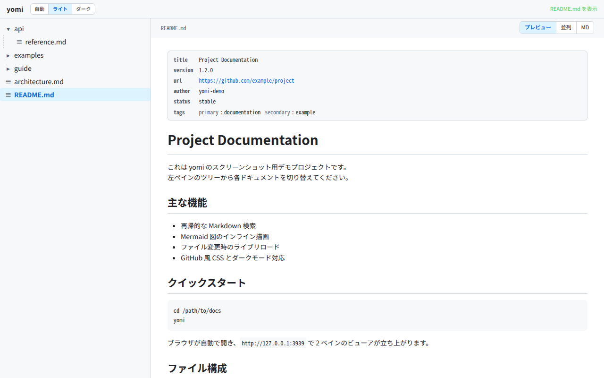
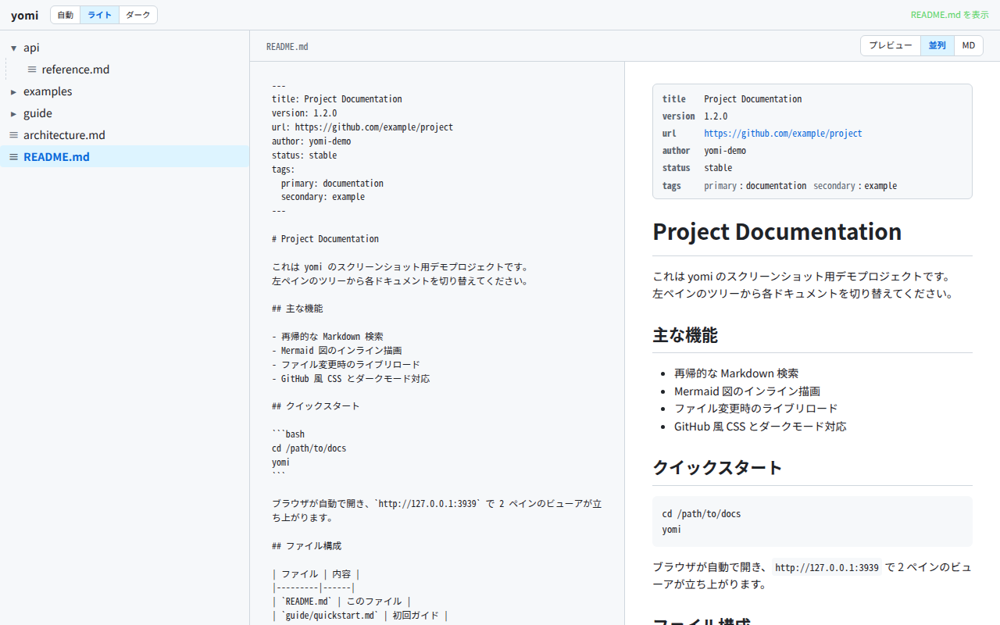
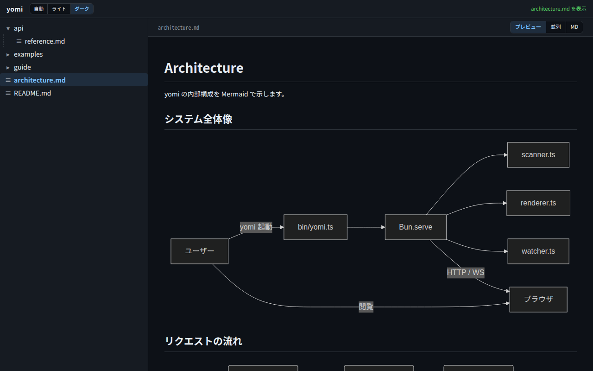

# yomi (読み)

[](https://github.com/ef-tech/yomi/actions/workflows/ci.yml)
[](LICENSE)

ローカル Markdown ビューア。カレントディレクトリ配下の `.md` ファイルを再帰的に集めて、2 ペインのブラウザ UI（左：ツリー、右：プレビュー）で読むためのコマンドラインツール。

<picture>
  <source media="(prefers-color-scheme: dark)" srcset="docs/screenshots/dark-preview.png">
  
</picture>

## 特徴

- `cd <ドキュメント置き場> && yomi` で立ち上がる
- Mermaid 図のインライン描画
- ファイル保存で自動リロード（ライブプレビュー）
- GitHub 風 CSS、システムのダーク/ライト追従
- 同 LAN 内の別端末からも閲覧可（`--host 127.0.0.1` でローカル限定）
- ブラウザ内 Markdown 編集（Ctrl/Cmd+S で保存）
- 見出しから生成する目次（TOC）パネル（追従ハイライト付き）
- プレビュー内リンクの遷移対応：相対 md は yomi 内ジャンプ、外部 URL は警告付き
- ブラウザの戻る/進むに対応、URL `?path=foo.md` でリロード復元・URL コピペで再現
- GFM タスクリスト `- [ ] xxx` をプレビュー上でクリックして ON/OFF、md ファイルにも反映
- Markdown 内の画像 `` を相対パス解決して表示（同階層・`../`・サブディレクトリ対応）

## スクリーンショット

| 並列ビュー (Markdown + プレビュー) | Mermaid 図のインライン描画 (ダーク) |
|---|---|
|  |  |

## 必要環境

- [Bun](https://bun.sh) v1.0+

## インストール

```bash
bun install -g github:ef-tech/yomi
```

## アップデート

最新の `main` を取得するには、もう一度同じコマンドを実行します。
Bun は同じパッケージ名で再インストールするとリモートの最新ソースを取得して上書きします。

```bash
bun install -g github:ef-tech/yomi
```

特定のタグ・ブランチ・コミットを使いたい場合：

```bash
bun install -g github:ef-tech/yomi#v0.2.0    # タグ
bun install -g github:ef-tech/yomi#main      # ブランチ
bun install -g github:ef-tech/yomi#abc1234   # コミット SHA
```

## アンインストール

```bash
bun remove -g yomi
```

インストール済みのバージョンを確認したい場合：

```bash
bun pm ls -g | grep yomi
```

## 使い方

```bash
cd /path/to/docs
yomi
```

ブラウザが自動で開きます。

### オプション

```
yomi [options]
  --port <n>      ポートを指定（デフォルト: 3939 から自動探索）
  --no-open       ブラウザを自動で開かない
  --host <addr>   バインドアドレス（デフォルト: 0.0.0.0、同 LAN から閲覧可）
                  ローカル限定にするには --host 127.0.0.1
  --depth <n>, -L <n>
                  読み込む階層の深さを制限（tree -L 相当。デフォルト: 無制限）
                  1 でルート直下のみ。深い md は読み込まず監視もしない
  --help, -h      ヘルプ
```

大きなディレクトリツリーでは `--depth`（短縮 `-L`）で起動時にスキャン/監視する階層を絞れる。`tree -L <level>` と同じく、ルート直下を深さ 1 として数える。深さを超えた Markdown は読み込まれず、ファイル監視（ライブリロード）の対象からも外れるため、起動が速くなり inotify の watch 数も減る。深い階層を見たいときは深さを上げて起動し直す。

### ファイルツリー

左ツリー上部のツールバーから、ツリー全体を一括で開閉できる。

- **⊞ 全て開く**: 全ディレクトリを展開
- **⊟ 全て閉じる**: 初期状態（ルート直下のみ表示）に戻す

ディレクトリの開閉状態は `localStorage` に保存され、リロード後も維持される。

### 目次 (TOC)

トップバー右の「📖 目次」ボタン (または `Ctrl/Cmd+Shift+O`) で、Markdown の見出しから生成した目次パネルを右端に開く/閉じる。

- **追従ハイライト**: スクロールに合わせて現在地のセクションが自動でハイライトされる
- **クリックでジャンプ**: エントリをクリックすると該当見出しへスムーズスクロール
- **階層切替**: パネル下部「▾ H4- 展開」で `H1-H3` のみ ↔ `H1-H6` 全部を切替
- **モード連携**:
  - `MD` モード時にボタンを押すと、一時的に `プレビュー` に切替 (TOC を閉じると元に戻る、`localStorage` は変更しない)
  - 編集モード中は TOC が一時非表示になり、編集終了で元の状態に復元
- 永続化: 開閉状態と階層レベルは `localStorage` に保存

見出し数が 0 のドキュメントでは「目次がありません」と表示。

### リンクの遷移

プレビュー内の `<a href>` リンクをクリックした時の挙動:

| 種類 | 例 | 動作 |
|---|---|---|
| 相対 md パス | `[X](other.md)` `[Y](../bar.md)` | yomi 内で該当ファイルに遷移 (左ツリー選択と同等) |
| 拡張子なし相対 | `[X](foo)` | `foo.md` → `.markdown` → `.mdx` の順に探索して遷移 |
| 相対 PDF パス | `[X](return_voucher.pdf)` | `/api/asset?path=...` を新規タブで開き、ブラウザ内蔵 PDF ビューアで表示 (Issue #37) |
| アンカー | `[B](#使い方)` | 既存の見出しジャンプ動作を維持 |
| 外部 URL | `[G](https://...)` `[M](mailto:...)` | 警告バナー → 「開く」で新規タブ、「閉じる」でキャンセル |
| `javascript:` スキーム | `[X](javascript:...)` | **無条件ブロック** |
| 存在しない相対 path | `[X](missing.md)` | 「ファイルが見つかりません」を表示、遷移なし |

外部 URL の警告バナーは Esc キーで閉じられ、新規タブは `noopener,noreferrer` で開かれる (tabnabbing 防止)。編集モード中の内部リンククリックは未保存変更がある場合に確認ダイアログが出る。

### 画像のプレビュー

Markdown 内の `` の相対パスは、yomi が `GET /api/asset?path=...` 経由で配信してプレビューに表示します。md の隣に置いた `screenshot.png` や `../images/logo.svg` のような参照がそのまま見えます。

| 種類 | 例 | 動作 |
|---|---|---|
| 相対パス画像 | `` `` | カレント md のディレクトリから解決して表示 |
| 外部 URL | `` `` | そのまま `` に渡す |
| `javascript:` スキーム | `` | **無条件ブロック**（空 src に書き換え） |
| 画像以外の拡張子 | `` | `/api/asset` 側で 400（読み取り拒否） |
| ルート外への `..` / 絶対パス | `` `` | `resolveSafe` で 400 |
| サイズ超過 (>50 MB) | 大きな画像 | 413 |

対応拡張子: `.png` / `.jpg` / `.jpeg` / `.gif` / `.webp` / `.svg` / `.avif` / `.bmp` / `.ico`。SVG は `X-Content-Type-Options: nosniff` + `Content-Disposition: inline` で MIME sniff 経由の XSS を抑制しています。強 ETag (`"<sha256-prefix>"`) + `Cache-Control: no-cache` を返すので、ブラウザは `If-None-Match` 304 でキャッシュを使いつつ、画像を編集すれば次のリクエストで再フェッチされます (Issue #22 で内容ベース ETag に変更、`cp -a` 等で mtime + size を保ったまま書き換えても確実に検出)。ファイル取得は `fs.open` で取った fd 経由で stat + read を行うので、resolveSafe 後の symlink swap (TOCTOU) でも意図しないファイルが配信される経路は塞いでいます。

プレビュー内の画像をクリックすると、その画像 URL が新しいタブで開きます（`` を `<a target="_blank" rel="noopener noreferrer">` で wrap）。ブラウザネイティブの画像表示で原寸 / ズーム / 保存ができます。hover で `cursor: zoom-in` を表示。markdown で `[](url)` のようにリンクで囲んだ画像はリンク先が優先され、画像ジャンプは発火しません。

### 並列モードのスクロール同期 (Issue #9)

**並列** モード (md ソース + プレビューの 2 ペイン) では、見出し基準でスクロール位置が左右同期します。`<h1>` 〜 `<h6>` に source 上の絶対行番号を `data-line` 属性で埋め、source 側の行ベース Y 座標と preview 側の `offsetTop` を線形補間する純関数で対応付けます。

| モード | 同期 |
|---|---|
| `preview` (単独) | N/A |
| `並列` | 有効 (デフォルト ON) |
| `MD` (単独) | N/A |
| 編集モード (textarea + preview) | 無効 (textarea のキャレット位置を乱さないため) |

見出しが 0 個の md では pair が作れないので両ペインが独立してスクロールします。Mermaid 図の async 描画完了後も pair が再構築されるので、図を含む md でも同期が乱れません。設定は `localStorage` (`yomi:scrollSync:v1`、デフォルト ON) に保存されます。

### ナビゲーション / 履歴

- 「現在開いているファイル」は URL クエリ `?path=foo.md` に反映される
- 見出しまで含む URL `?path=foo.md#見出し` で開けば、その見出し位置までスクロールして表示（deep-link）
- ブラウザの **戻る / 進む** がファイル切替単位で素直に効く（プレビュー内リンク・左ツリー選択どちらも履歴に積まれる）
- リロードしても URL から現在ファイル + 見出し位置が復元される
- URL をコピペすれば同じ画面を再現できる（同じディレクトリで起動した別マシン / 別タブで開ける）
- ライブリロード（ファイル保存検知での再描画）とアンカージャンプ（`#見出し`）は履歴を積まない
- 編集モード中に「戻る」を押すと未保存変更がある場合に確認ダイアログが出て、Cancel すると元の編集中ファイルへジャンプし戻る

### インタラクティブ タスクリスト

GFM タスクリスト `- [ ] xxx` / `- [x] xxx` をプレビュー上でそのままクリックして ON/OFF できる。チェック状態は md ファイルにも書き戻されるので、TODO リストや手順書を「読みながら進捗管理」できる。

- プレビュー内のチェックボックスをクリック → 該当行が `- [ ]` ⇄ `- [x]` に反転、`POST /api/file` で保存
- 既存の楽観的ロック (`baseSha`) を流用、他経路で更新済みなら競合バナーが出る
- 編集モード中はクリック不可（編集モード優先、状態の二重管理を避ける）
- インデント（ネスト）された `  - [ ] サブタスク` や `*` / `+` の bullet も対応
- code fence (```...``` / `~~~...~~~`) 内のタスク風文字列は無視される

### 除外パターンのカスタマイズ (`.yomiignore`)

カレントディレクトリ直下に `.yomiignore` を置けば、デフォルトの除外パターン（`node_modules`, `.git`, `dist` など）に追加できます。1 行 1 ディレクトリ/ファイル名、`#` で始まる行はコメントです。

```
# .yomiignore
# 個人メモは除外
private
backup
.archive
```

現状はディレクトリ/ファイル名の完全一致のみ。グロブ (`*`, `**`) は未対応です。

### 編集機能

右ペインのヘッダにある「編集」ボタンを押すと `<textarea>` に切り替わり、その場で Markdown を書き換えられます。

- **保存**: 「保存して閉じる」ボタン (保存→編集終了)、または `Ctrl/Cmd+S` (保存のみ、編集継続)
- **破棄**: 「破棄」ボタンで未保存の変更を捨てて編集モードを抜ける
- **未保存表示**: ヘッダに `● 未保存` が点灯。タブを閉じようとすると警告
- **同時編集 (Lost Update) 検知**: 編集中に他プロセスが同じファイルを書き換えた場合、保存時に競合バナーが出る。「サーバ内容を取り込む」「強制上書き」「閉じる」から選択

#### 新規作成

左ツリーから新しい Markdown ファイルをその場で作成できます。

- **ツールバーの「＋」**: ルート直下に作成
- **ディレクトリ行の「＋」**: そのディレクトリの子として作成 (マウスは hover で表示、キーボードは `Tab` フォーカスで表示。スクリーンリーダーからも到達可能)
- インライン入力欄が開くので、ファイル名を入力して `Enter` で確定、`Esc` または入力欄外をクリック (フォーカス喪失) でキャンセル
- 拡張子は省略可。許可拡張子 (`.md` / `.markdown` / `.mdx`、大文字小文字問わず) で終わる名前はそのまま、それ以外は末尾に `.md` を付与 (`foo` → `foo.md`、`foo.txt` → `foo.txt.md`)
- 作成に成功すると新規ファイルが選択され、そのまま編集モードで開く (別ファイルを未保存で編集中に破棄確認をキャンセルした場合は、ファイルだけ作成されエディタは切り替わらない)
- 名前の衝突 (既存ファイル) は 409 で拒否され、エラーがヘッダに表示される
- パストラバーサル・許可外拡張子・除外ディレクトリ (`node_modules` 等、`.yomiignore` 含む) 配下への作成はサーバ側で拒否

#### LAN 越しに編集する場合のセキュリティ

編集機能を入れたことで yomi は **LAN から誰でも書き込み可能なエンドポイント** を持つことになります。yomi は CSRF 対策として **`Origin` ヘッダ検証** を行い、yomi 自身と同じオリジンからのリクエストだけを受け付けます。これによりブラウザ経由の攻撃ページからの POST は 403 で拒否されます。ただし以下に注意してください:

- **信頼できないネットワーク** (公衆 Wi-Fi 等) で `0.0.0.0` バインドのまま起動するのは推奨しません。`--host 127.0.0.1` でローカル限定にしてください
- `Origin` ヘッダを送らないクライアント (curl, Postman 等) は許可されます。これは API 利用を想定した挙動で、ブラウザ CSRF の脅威モデル外です
- yomi に認証機構はありません。LAN 越し編集は「LAN 内の全員が信頼できる」前提でのみ有効です

### LAN からの閲覧

デフォルトでは `0.0.0.0` にバインドするため、同じネットワーク上のスマートフォンや別端末から起動時に表示される LAN IP の URL でアクセスできます。

```
yomi が起動しました
  ローカル   http://127.0.0.1:3939
  LAN        http://192.168.0.100:3939
```

**注意**: 認証機能はないため、信頼できないネットワーク上では `--host 127.0.0.1` で自端末のみに制限してください。

## 開発

- 設計の出発点: [`docs/design-yomi-20260430.md`](docs/design-yomi-20260430.md)
- 変更履歴・設計書からの差分: [`CHANGELOG.md`](CHANGELOG.md)

### テスト

`bun test` で全テストを実行できます。

```bash
bun test
```

`tests/` 配下に `*.test.ts` 形式で配置されています。サーバー側の純関数・セキュリティ関連・パーサ・ファイルスキャナに加え、DOM に依存しないクライアント純関数 (`public/new-file.js` 等) もカバーしています（DOM 結合した `app.js` 本体は対象外）。

```bash
bun test tests/util/        # util ディレクトリだけ
bun test tests/safepath     # ファイル名で絞り込み
```

### 型チェック

```bash
bun run typecheck
```

## トラブルシューティング

### ライブリロードと監視上限 (Linux)

yomi はファイル監視で `node_modules` や `.git` などの除外ディレクトリには watch を張らないため、通常は監視上限に触れません。それでも巨大なツリーを開くと、Linux の inotify watch 上限 (`fs.inotify.max_user_watches`) に達して次の警告が出ることがあります。

```
ファイル監視の上限に達しました (ENOSPC)。…
```

`ENOSPC` はディスク容量不足ではなく **inotify watch 上限の枯渇** を意味します。上限を引き上げるには:

```bash
# 一時的に変更
sudo sysctl fs.inotify.max_user_watches=524288

# 永続化
echo 'fs.inotify.max_user_watches=524288' | sudo tee /etc/sysctl.d/99-inotify.conf
sudo sysctl -p /etc/sysctl.d/99-inotify.conf
```

## ライセンス

MIT — 詳細は [`LICENSE`](LICENSE) を参照。
