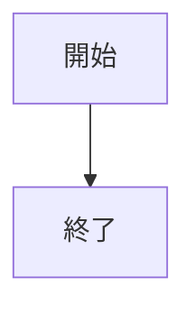

# コードブロック

コピーボタン (#165) の E2E で使う。**ボタンは描画後の DOM に後付けする**ので、
サニタイザ (#21 / #59) の許可設定は広げていない。

```js
const greet = (name) => `hello ${name}`;
```

Mermaid は図として描画されるのでボタンを出さない。


```mermaid
graph TD
  A[開始] --> B[終了]
```
